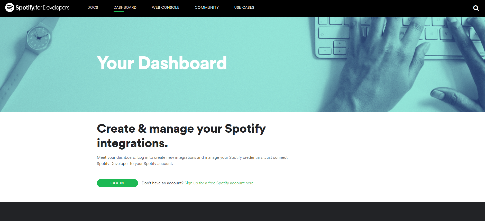
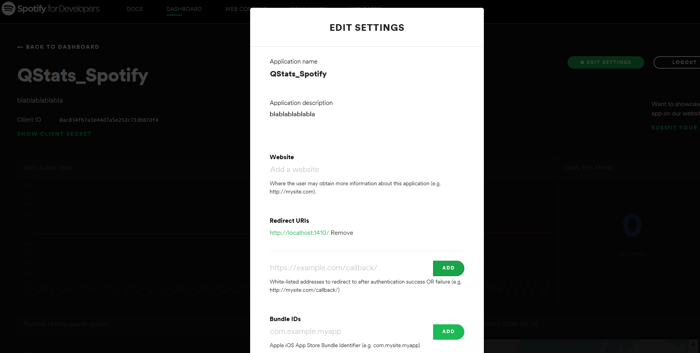

```{r setup, include=FALSE}
knitr::opts_chunk$set(echo = TRUE)
```

<br><br>
The `Rspotify` package is finally on [CRAN](https://CRAN.R-project.org/package=Rspotify). Now you can 
install it straight from the official R repository. But what is 
`Rspotify`, right? 

Basically, `Rspotify` is a package that allows you to access data 
from the [Spotify API](https://developer.spotify.com/). To make 
things easier, in this post I'll guide you on how to use it.
<br><br>

### Step 1 - Create an app

The first thing you need to do is to create an app on 
the Spotify's developer platform. 
You can do it accessing this [dashboard](https://developer.spotify.com/dashboard/)<br><br>

```{r, echo = FALSE}

```

<br><br>
After accessing the page, you'll need to login and create an app:
<br><br>

```{r, echo = FALSE}
knitr::include_graphics("img/newapp.png")
```

```{r, echo = FALSE}

```


<br>
Since I'm not creating a commercial app, these are my screens. 
If this is not your case, you must declare it at this point 
and follow their instructions.
<br><br>

```{r, echo = FALSE, out.height='50%'}

```


<br><br>

```{r, echo = FALSE}
knitr::include_graphics("img/newapp4.png")
```


<br><br>
Now, you'll need to save your **client ID** and your **client Secret**. You'll also need to click on edit settings and change the redirect 
`urls` to `http://localhost:1410/`.
<br><br>

```{r, echo = FALSE}
knitr::include_graphics("img/newapp5.png")
```

```{r, echo = FALSE}

```

<br><br>

### Step 2 - Install Rspotify

You know the drill, right? To install the stable version from CRAN, 
the official R respository, just run:

```{r, eval = FALSE}
install.packages("Rspotify")
```

```{r}
library(Rspotify)
library(tidyverse)
```

### Step 3 - Try the functions

The first thing you'll need to do is authenticate your API access 
using the **spotifyOAuth()** function. The authentication process 
should automatically open your browser with just:

```{r eval=FALSE}
keys <- spotifyOAuth("app_id","client_id","client_secret")
```

```{r, echo = FALSE}
keys <- readRDS("keys.rds")
```


Note: you must replace 'app_id', 'client_id' and 'client_secret'
with your own credentials, with the `''`, as characters. 


If everything went right, then you are ready to go. Your 
authentication is saved in the `keys`object, which will 
be used whenever you need to use a function that requires
it. Let's try now the **getUser()** function to get data 
about an specific user.


```{r, eval = TRUE}
# Using  my own username
user <- getUser("t.mendesdantas", token = keys)

user$display_name # user name

user$id # user id

user$followers # number of followers
```

If you want to get the playlists from an user,
the function needed is **getPlaylists()**:

```{r}
# getting the playlists made by Spotify
user_playlists <- getPlaylists("spotify", token = keys)
user_playlists %>% slice(1:5) %>% knitr::kable()
```


The songs from a specific playlist can be retrieved 
using the **getPlaylistSongs()** function. Let's get the songs 
from the *Today's Top Hits*  playlist from Spotify:

```{r}
playlist_songs <- getPlaylistSongs("spotify","37i9dQZF1DXcBWIGoYBM5M",
                                   token =  keys) %>%
  select(tracks, popularity, artist) 

playlist_songs %>% slice(1:15) %>% knitr::kable()
```


You can also directly search songs, using
**searchTrack()**. Let's search for the songs
with 'Bohemian Rhapsody' in their names:

```{r}
find_song <- searchTrack("bohemian rhapsody", token = keys)

find_song %>% slice(1:5)  %>% arrange(desc(popularity)) %>%
  knitr::kable()
```

As the API brings us every song that contains 
the string passed to the function, arranging by 
decrescent popularity is a good trick to find 
exactly what we want. When we do this, the song
from Bohemian Rhapsody, from Queen, appears as
first in the list. 

You may want to look for an artist, using the
**searchArtist()** function. Let's see what the API 
brings us when we search for bands with
'Queen' in their name:


```{r}
find_artist <- searchArtist("queen",token = keys)

find_artist %>% slice(1:5)  %>% arrange(desc(popularity)) %>%
  knitr::kable()
```


Now, we have the exact id of the band, which will 
be useful in the next function: **getAlbums()**. This 
function is used to get information about the albums 
available on Spotify from an specific artist:

```{r}
# using the id we found before 
queen_albums <- getAlbums("1dfeR4HaWDbWqFHLkxsg1d", token = keys)

queen_albums %>% slice(1:10) %>% knitr::kable()
```


To get the more info about an specific album and its songs,
you should use **getAlbumInfo()**  and **getAlbum()**. 
For example, let's check the album 'Made in Heaven':

```{r}
id_album <- queen_albums %>% 
  filter(name == "Made In Heaven") %>% 
  pull(id)

made_in_heaven_info <- getAlbumInfo(id_album, token = keys)
made_in_heaven_info %>% knitr::kable()
```


```{r}
made_in_heaven <- getAlbum(id_album, token = keys) %>% 
  select(-preview_url)

made_in_heaven %>% select(id, name, duration_ms, track_number) %>%
  knitr::kable()
```


So far, we have seen a lot of interesting stuff, but there's more.
We can also check the features from a specific song, using the
**getFeatures()** function. Let's check the 'Made In Heaven' song:

```{r}
id_song <- made_in_heaven %>% 
  filter(name == "Made In Heaven") %>% 
  pull(id)

song <- getFeatures(id_song, token = keys)
song %>% select(-uri, -analysis_url) %>% glimpse() %>% knitr::kable()
```

## Wrap up

In this blog post, we:   

  - we explained how to create an app and 
  obtain the authorization to access the 
  [Spotify API](https://developer.spotify.com/documentation/web-api/).  
  - introduced the `Rspotify` package, which
  connects `R` with the [Spotify API](https://developer.spotify.com/documentation/web-api/).
  - we used the band 'The Queen' as the basis for our examples.
  
The `RSpotify` is a package with a 
tremendous potential. There a lot of cool, 
interesting analysis we can make with the
information it brings us. Soon we'll more
posts about it!


