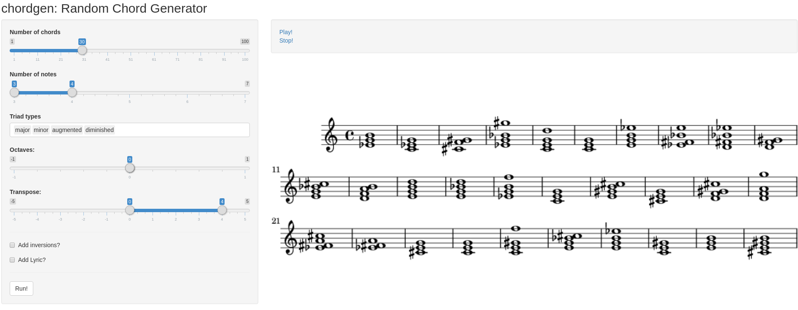

```{r, echo = FALSE}
knitr::opts_chunk$set(
  echo = TRUE,
  collapse = TRUE,
  comment = "#>",
  fig.path = "README-"
)
```

The goal of `music21` is to have an pipe-able API of [music21 python library](http://web.mit.edu/music21/doc/index.html) [@cuthbert2010music21]. It uses [`reticulate`](https://github.com/rstudio/reticulate) package in the backend [@reticulate].

According to `music21`'s site, it can be used to answer questions like:

- I wonder how often Bach does that.
- I wish I knew which band was the first to use these chords in this order.
- I'll bet we'd know more about Renaissance counterpoint (or Indian ragas or post-tonal pitch structures or the form of minuets) if I could write a program to automatically write more of them.

Actually, `music21` is more limited than the original python library. However, it is really easy to run any functions from `music21` inside R.

## Installation

`music21` package is based on the `music21` python library. To install this package, you may want to use `reticulate`. However, there are some issues:

- `music21` version 5.3.0 is Python 3 only.
- It is not trivial to make sure that you are using Python 3 on R.

I recommend the workflow as follows.

### Install Anaconda

Anaconda is a platform to install python packages without pain. You can access download and install the [latest version here](https://www.anaconda.com/download/). **Please make sure to install Python 3.x**. If you use Ubuntu, there is a [great tutorial from DigitalOcean](https://www.digitalocean.com/community/tutorials/how-to-install-the-anaconda-python-distribution-on-ubuntu-16-04).

### Create a conda environment

Environments are folders where you install Python packages. Environments are useful because Python usually has many installation paths and it is difficult to have a consistent general configuration. New virtual environments usually come with some basic packages and a new path to a python command line binary.

Conda environments are Anaconda-optimized environments that install some data science packages automatically. 

```{r pip, eval=FALSE}
reticulate::conda_create("r-py3")
# Upgrade pip to latest version
reticulate::conda_install("r-py3", "pip")
```

### Install music21 Python package

You can install `music21` using `conda_install()`:

```{r conda-music21, eval=FALSE}
reticulate::conda_install("r-py3", "music21", pip = TRUE)
```

You must use `pip=TRUE` because `music21` is not available in the default conda channels.


### Install music21 R package

`music21` is not on CRAN as the main functions are very likely to change. You can install `music21` from github with:

```{r gh-installation, eval = FALSE}
# install.packages("devtools")
devtools::install_github("jtrecenti/music21")
```

### Make sure you are using the environment you just created

```{r use-condaenv}
reticulate::use_condaenv("r-py3", required = TRUE)
```

```{r version, eval=FALSE}
library(music21)
music21$VERSION
```

    [[1]]
    [1] 5
    
    [[2]]
    [1] 3
    
    [[3]]
    [1] 0
    
    [[4]]
    [1] ""


If your `VERSION` it is not 5.3.0, you may try to force your python version to 

```{r force, eval=FALSE}
reticulate::use_python("~/anaconda3/envs/r-py3/bin/python")
```

so that your `py_config()` returns

```{r config, eval=FALSE}
reticulate::py_config()
```

    python:         /home/jtrecenti/anaconda3/envs/r-py3/bin/python
    libpython:      /home/jtrecenti/anaconda3/envs/r-py3/lib/libpython3.7m.so
    pythonhome:     /home/jtrecenti/anaconda3/envs/r-py3:/home/jtrecenti/anaconda3/envs/r-py3
    version:        3.7.0 (default, Jun 28 2018, 13:15:42)  [GCC 7.2.0]
    numpy:           [NOT FOUND]
    music21:        /home/jtrecenti/anaconda3/envs/r-py3/lib/python3.7/site-packages/music21
    
    NOTE: Python version was forced by use_python function


### Extra: install lilypond

To use the `plot` and `view` methods, you'll also have to install `lilypond`. On Ubuntu, run:

```{bash, eval=FALSE}
sudo apt-get install lilypond
```

If you use Windows or Mac, you can find detailed instructions [here](http://lilypond.org/download.html).

## The `music21` object

```{r}
library(music21)
library(magrittr)
music21
```

`music21` object stores the python module. It is possible to run any function from it just by using `$`, treating it as a Reference Class object.

```{r, results="asis"}
note <- music21$note$Note("C#")
note
```

```{r note, layout="l-body"}
plot(note)
```

## Example 1: bach chorales

### Show bach chorales

```{r message=FALSE}
get_composer("bach") %>% 
  head()
```

Let's get one of these paths and read:

```{r}
bach_music <- get_composer("bach")[[61]] %>% 
  read_music()
```

### Plot bwv165.6 music

Now let's plot the music!

```{r bach, fig.width=6, fig.height=5}
plot(bach_music)
```

In RStudio, you can use the `view` function to see the music inside viewer pane.

### Print bwv165.6 music (soprano part)

```{r}
bach_music[[1]]
```

# Example 2: Random chord generator

Last year I made a random chord generator package to study relative pitch perception. My goal was to hear random chords and figure out what was the chord and the inversion. The result was this nice R package made on top of `music21`.

`chordgen` package has just one function. It generates `n` chords and return a `music21` object. There are many options to the list of chords it can generate.

```{r, fig.height=1.8}
# devtools::install_github("r-music/chordgen")
library(chordgen)

chordgen(18, n_notes = 3:4, 
         triad_types = 1:2, 
         octave = 0, 
         transpose = 0, 
         add_lyric = FALSE) %>% 
  plot()
```

It is also possible to add lyrics, thanks to the [`chordify`](http://web.mit.edu/music21/doc/usersGuide/usersGuide_09_chordify.html#usersguide-09-chordify) algorithm implemented in `music21`.

```{r, fig.height=1.8}
chordgen(18, n_notes = 3, 
         triad_types = 1:2, 
         octave = 0, 
         transpose = 0:4, 
         add_lyric = TRUE) %>% 
  plot()
```

We have also created a shiny app to run and play random chords. If `music21` is correctly installed, you can just run:

```{r shiny, eval=FALSE}
shiny::runGitHub("chordgen", "r-music", subdir="inst/chordgen/")
```


```{r, echo=FALSE}

```


In a future post, we'll explain how to create and label random chords in detail.

# Contribute

`music21` is just a crawling baby for now. In my opinion, `music21` can be a great tool for i) structured music data IO and ii) music statistical modeling. The biggest challenge for now is think how to make a *tidy* API to it.

What would you like to do with `music21`? Please comment in the comment section.

Thanks!