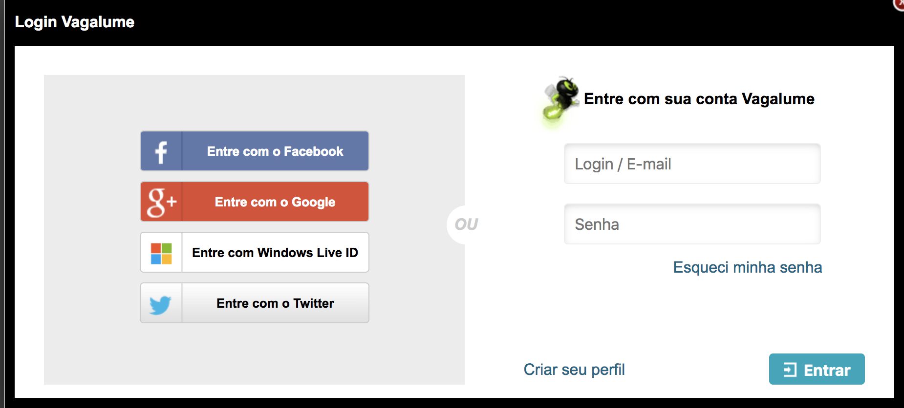
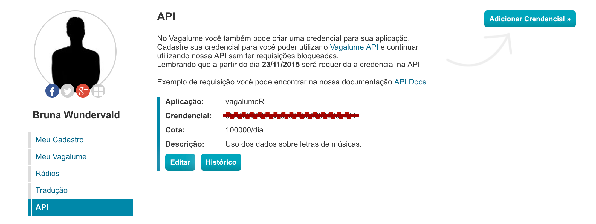
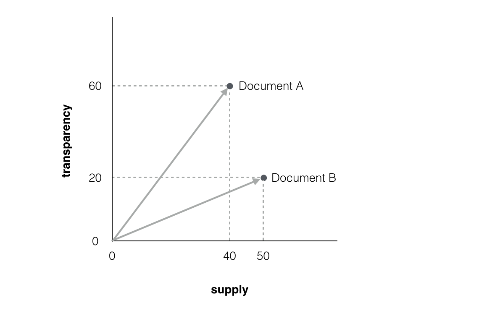

```{r setup, include=FALSE}
knitr::opts_chunk$set(echo = TRUE, fig.align = 'center', cache = TRUE)
```


# Intro

Hey people! Today we are going to talk a little bit about my 
package `vagalumeR` and what we can do with it. 

The `vagalumeR` package provides us with access to the [Vagalume](https://www.vagalume.com.br/)
website API. [Vagalume](https://www.vagalume.com.br/) is a music 
portal, and its API gives us information about discographies, 
music names, related artists, and the most important one, **music lyrics**.
Cool!

The first version of the package goes back to 2017 when I was 
taking a Text Mining course. For the course assignments, 
we were asked to deliver some interesting analysis using text and
the techniques we learned. As by that time I did not found anything 
related to music lyrics datasets, I made the package to solve this problem :)

# How to get the API

We are going to start by explaining how to get the *API key* .
You will need to be aware that [Vagalume](https://www.vagalume.com.br/)
is a **Brazilian** website, so everything there will be in Portuguese. 
The following explains how to go through that barrier and successfully get the key.  

1. Access https://auth.vagalume.com.br/ and log in (it can be done
with some social media account in the "Entre com" buttons):

```{r, results=TRUE, echo = FALSE}

```


2. Go to https://auth.vagalume.com.br/settings/api/ and create an application:
  - Click on the "Adicionar Credencial" button and fill the name
  ("Nome da aplicação") and its purpose ("Descrição da aplicação"). Click
  "Cadastrar" to create it!
  
3. Now you must have an API key available for use. In 
https://auth.vagalume.com.br/settings/api/, copy your
key from the "Credencial" section:


```{r, results=TRUE, echo = FALSE}

```

And there you have it. Now it is just a matter of having your key
stored in an object, ready to be used when needed:

```{r}
key <- "your-api-key"
```

```{r}
key <- "3f4f4a35789cae8ce84b5579069db511"
```

The `vagalumeR` package has 6 main functions:

  - `artistInfo()`: brings us information about an specific artist.
  - `discography()`: gives us the discography of an artist.
  - `relatedInfo()`: brings us information about related artists 
  of one specific musician/band.
  - `songNames()`: gives us the names for the songs of an artist. 
  - `topLyrics()`: tells us about the top acessed lyrics of an artist.
  - `lyrics()`: brings the full lyrics and translation (when available)
  of the songs!
  

For today's post, we will be working with the band called 
[Belle and Sebastian](https://belleandsebastian.com/). I personally like
the band style and their lyrics, which can be taken as very poetic 
sometimes. 

The lyrics obtention process needs two things: an artist, for who
we will first get the name of the songs, and the song ids. The code 
is as follows:

```{r}
library(tidyverse) # always
library(vagalumeR) # loading the package!

# defining the artist 
artist <- "belle-sebastian"

# song names retrieval
song <- songNames(artist)

# mapping the lyrics function over the ids found
lyrics_data <- song %>% 
  pull(song.id) %>% 
  purrr::map(lyrics, 
             artist = artist,
             type = "id", 
             key = key) %>%
  purrr::map_df(data.frame) %>% 
  slice(-15) # There is a repeated lyric there!

glimpse(lyrics_data) 
```

Now we have our artists id and name, the songs name and id, 
their language (2 for English and 1 for Portuguese!), the original
lyrics and the translation, when available. We can analyze 
term frequency in the songs, for example: 

```{r, fig.width = 4.5, fig.height=4}
library(tidytext)

unnested <- lyrics_data %>% 
  unnest_tokens(word, text) %>% 
  dplyr::anti_join(stop_words, by = c("word" = "word"))

unnested %>% 
  count(word) %>% 
  filter(n < quantile(n, 0.999)) %>% 
  top_n(n = 30) %>% 
  ggplot(aes(reorder(word, n), n)) +
  geom_linerange(aes(ymin = min(n), ymax = n, x = reorder(word, n)),
                     position = position_dodge(width = 0.2), size = 1, 
                 colour = 'wheat1') + 
  geom_point(colour = 'salmon1', size = 3, alpha = 0.7) +
  coord_flip() +
  labs(x = 'Top 30 most common words', y = 'Counts') +
  theme_bw()
```

So those are the top 30 most common words in Belle & Sebastian songs.
Here we need to remember that lyrics actually have a lot of repetition, 
so this needs to be taken into consideration when evaluating word or
phrases frequencies. One alternative could be looking at the 2-grams
instead of only the words:

```{r, fig.width = 4.5, fig.height=4}
lyrics_data %>% 
  unnest_tokens(bigram, text, token = "ngrams", n = 2) %>%
  separate(bigram, c("word1", "word2"), sep = " ") %>%
  filter(!word1 %in% stop_words$word,
         !is.na(word1), !is.na(word2),
         !word2 %in% stop_words$word) %>%
  count(word1, word2, sort = TRUE) %>% 
  mutate(word = paste(word1, word2)) %>% 
  filter(n < quantile(n, 0.999)) %>% 
  arrange(desc(n)) %>% 
  slice(1:30) %>%  
  ggplot(aes(reorder(word, n), n)) +
  geom_linerange(aes(ymin = min(n), ymax = n, x = reorder(word, n)),
                 position = position_dodge(width = 0.2), size = 1, 
                 colour = 'wheat1') + 
  geom_point(colour = 'salmon1', size = 3, alpha = 0.7) +
  coord_flip() +
  labs(x = 'Top 30 most common 2-grams', y = 'Counts') +
  theme_bw()
```

Here we have very different results, with even some Portuguese
2-grams - which was not intentional :)

# Similarity analysis

Now we are going to do a simple similarity analysis. This kind of 
analysis is interesting because it allows us to clusters the 
lyrics of the songs, creating groups that are similar within then. 
Similarity analysis is very usual in recommendation systems, in the sense
that it is possible to recommend songs (or anything else) based 
on high similarity values.  

The measure of similarity between each song considered here will be the
`cosine distance`. This distance is based on the angle 
$\theta$ formed by two vectors in space. The $cos(\theta)$ 
is equivalent to the similarity between them and, with that, 
$1 - cos(\theta)$ is their distance:

$$D_{cos} = 1 - \frac{\mathbf{x}'\mathbf{y}}{\sqrt{(\mathbf{x}'\mathbf{x})
(\mathbf{y}'\mathbf{y})}} $$


```{r, results=TRUE, echo = FALSE}

```

As we are not going go through the details of the method, let us link this
[video here](https://www.youtube.com/watch?v=7cwBhWYHgsA) that 
specifies it better. We now use the distance measure to obtain a 
few clusters for the songs. In the plot above, the songs that appear
in the same circle are the similar ones, thereby forming a cluster:  


```{r, fig.height=6.8, fig.width=6.5, fig.align='center'}
library(tm)
library(packcircles)
library(viridis)

# creating the corpus and the document-term matrix 
cps <- VCorpus(VectorSource(lyrics_data$text),
                            readerControl = list(language = "en"))
dtm <- DocumentTermMatrix(cps)

# finding the distances and the clusters
dists <- proxy::dist(as.matrix(dtm), method = 'cosine')
clusters <- hclust(dists) 

# choosing by keep only 15 clusters 
classes <-  data.frame(class = cutree(clusters, k = 15), 
                       name = lyrics_data$song) %>% 
  group_by(class) %>% 
  summarise(n = n(), label = paste(name, collapse = ",\n"))

packing <- circleProgressiveLayout(classes$n, sizetype='area') %>% 
  bind_cols(classes)
circles <- circleLayoutVertices(packing, npoints=15)


# creating a circle plot to indicate which song is similar to which
p <- ggplot() + 
  geom_polygon(data = circles, aes(x, y, group = id, fill = as.factor(id)), 
               colour = "grey", alpha = 0.5) +
  geom_text(data = packing, aes(x = x, y = y, label = label, size = n)) +
  scale_size_continuous(range = c(1,3)) +
  scale_fill_manual(values = inferno(nrow(packing))) +
  theme_void() + 
  theme(legend.position = "none") +
  coord_equal() 

plotly::ggplotly(p)
```

# Wrap Up

In this blog post, we:

  - introduced the `vagalumeR` package, which extracts music lyrics and
  other information from the from the [Vagalume](https://www.vagalume.com.br/) 
  API. 
  - we used Belle & Sebastian as an example of how the extraction is done.
  - we presented a brief analysis of the music lyrics, along with a 
  similarity.
